# The Employee Tracker

  ## Description 
  This is application is designed for use as a Company Employee Database. This easy to use application will help those in charge of adding to the employee roster and adding organization designed to put these employees under their organizational chart. The option also includes to Add, Update, Change Roles for Employees, along with Adding Departments and yes even delete those employees information if they are leaving the company or terminated. Storing all this information in a secure database makes this a must have for any business. 
  

  ## Table of Contents
  - [Installation](#installation)
  - [Usage](#usage)
  - [Credits](#credits)
  - [License](#license)
  - [Features](#features)
  - [How To Contribute](#how-to-contribute)
  - [Author](#author)
  - [Test](#test)
  - [Screenshots](#screenshots)

  ## Installation 
  No installation is required at this moment. Backend work will been needed to initialize the database. However, having the files from the repository will allow you to install this node application. The database is inserted and manipulated with MySQL Workbench.

  ## Usage
  To run this application you need to run this:


```bash
node index.js
``` 
    
  ## Credits
  List your collaborators, if any, with links to their GitHub profiles.

  Karen Peazzoni: https://github.com/kpeazzoni \
  Josh Goeke: https://github.com/joshuagoeke \
  Myeonghun Jeong: https://github.com/mjtic \
  Rebecca Girndt: <https://github.com/Re-Gi> 

  And of course but not in the very least UTA Tutors: Meg Meyers!


  
  ## License 
  MIT License
  
  [](https://choosealicense.com/licenses/mit-license/.)
  
Copyright (c) [2023] [The Employee Tracker]

Permission is hereby granted, free of charge, to any person obtaining a copy
of this software and associated documentation files (the "Software"), to deal
in the Software without restriction, including without limitation the rights
to use, copy, modify, merge, publish, distribute, sublicense, and/or sell
copies of the Software, and to permit persons to whom the Software is
furnished to do so, subject to the following conditions:

The above copyright notice and this permission notice shall be included in all
copies or substantial portions of the Software.

THE SOFTWARE IS PROVIDED "AS IS", WITHOUT WARRANTY OF ANY KIND, EXPRESS OR
IMPLIED, INCLUDING BUT NOT LIMITED TO THE WARRANTIES OF MERCHANTABILITY,
FITNESS FOR A PARTICULAR PURPOSE AND NONINFRINGEMENT. IN NO EVENT SHALL THE
AUTHORS OR COPYRIGHT HOLDERS BE LIABLE FOR ANY CLAIM, DAMAGES OR OTHER
LIABILITY, WHETHER IN AN ACTION OF CONTRACT, TORT OR OTHERWISE, ARISING FROM,
OUT OF OR IN CONNECTION WITH THE SOFTWARE OR THE USE OR OTHER DEALINGS IN THE
SOFTWARE.
  
  

  ## Features
  The features of this application is to give them a great organization and real time flow chart of their work place. With the ability to delete employees this gives this app and even more day to day use with real life application.  

  ## How to Contribute
  You can contribute to the project by email me at: frappejcat@gmail.com

  ## Author 
  Christopher Zavala :
  https://github.com/chriszavala

  ## Test
 The user can test the functicallity of this application for their use. Please report any issues or bugs to make this an even better user experience.  

  ## Video Link inserted here:
  https://drive.google.com/file/d/1y-lHgQuhynVw1vHPk4hhzP8FQqxP3B1l/view

  ## Screenshots:
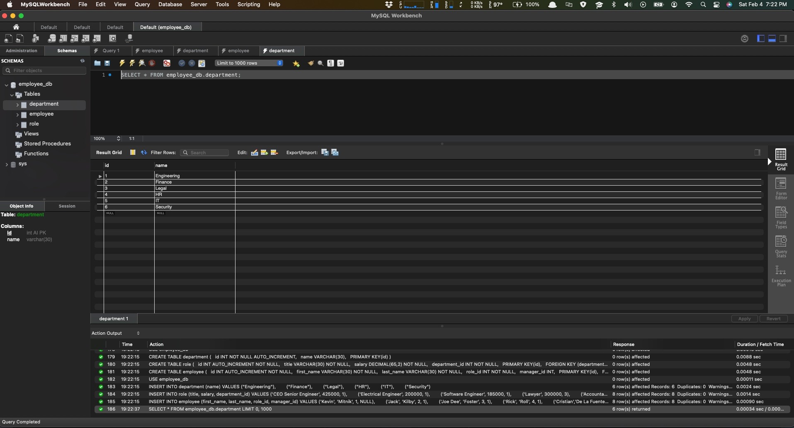
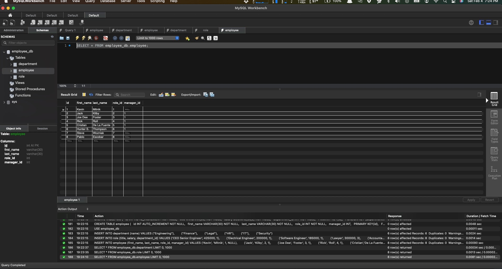
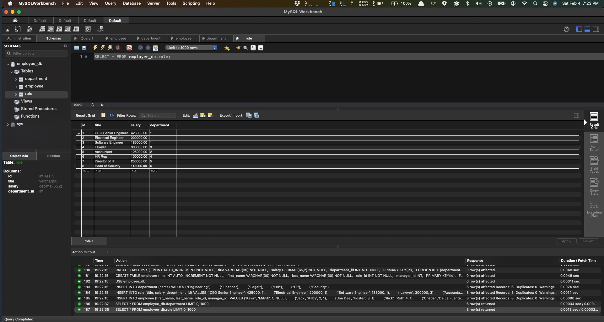
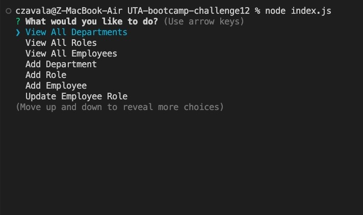
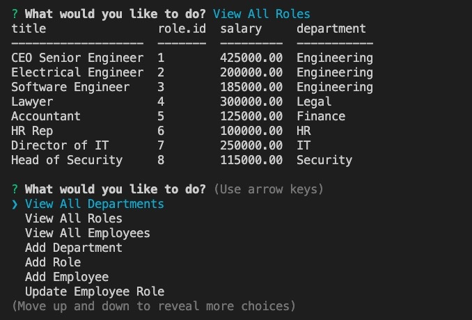
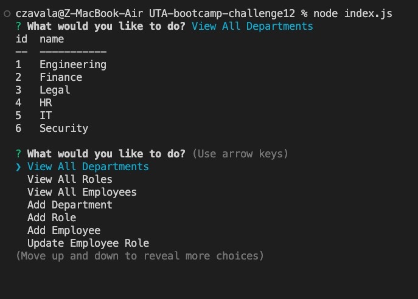
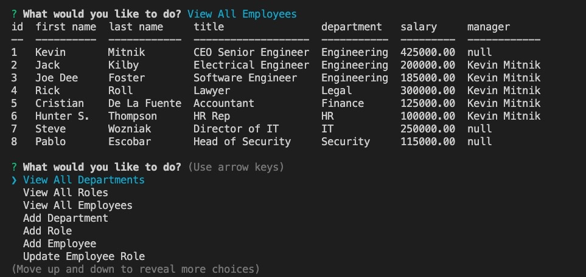
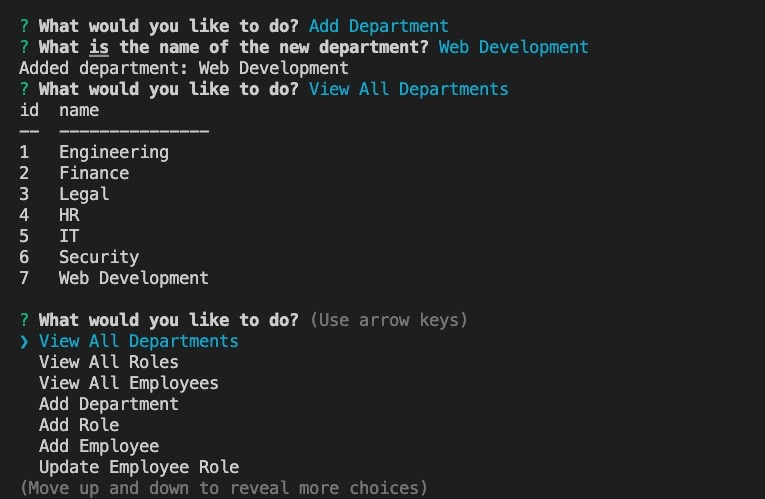
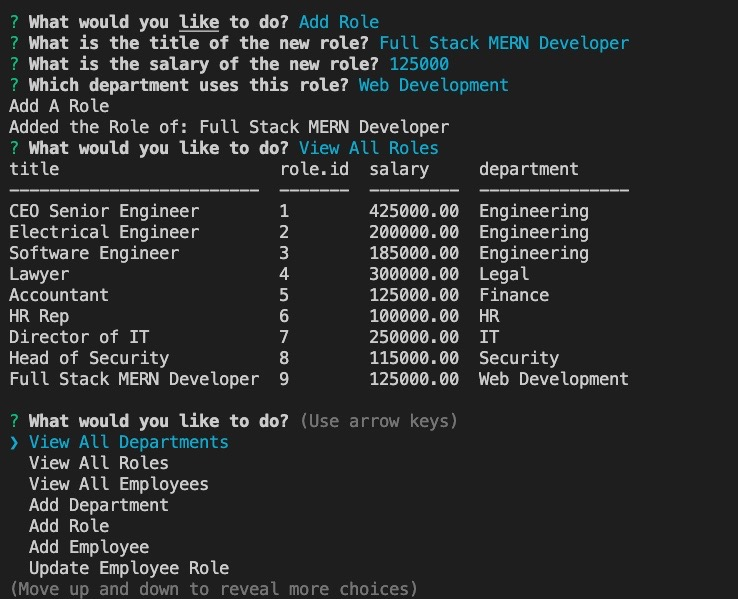
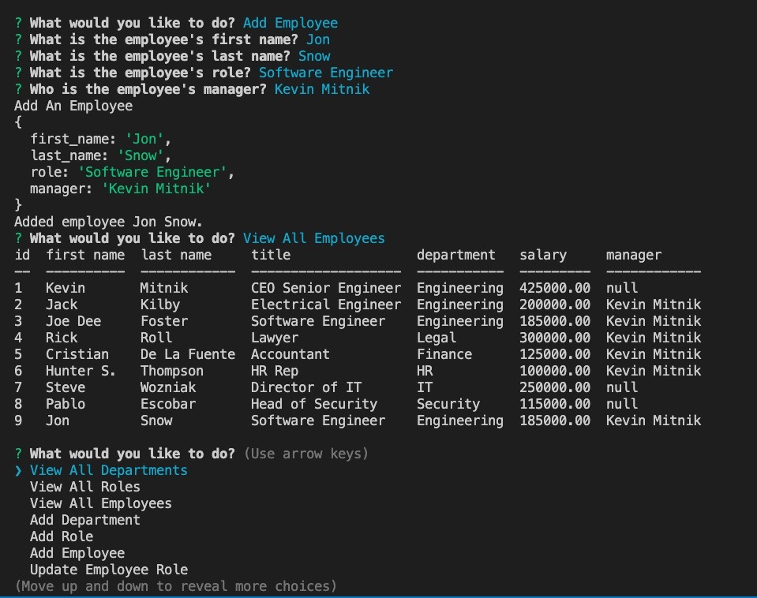
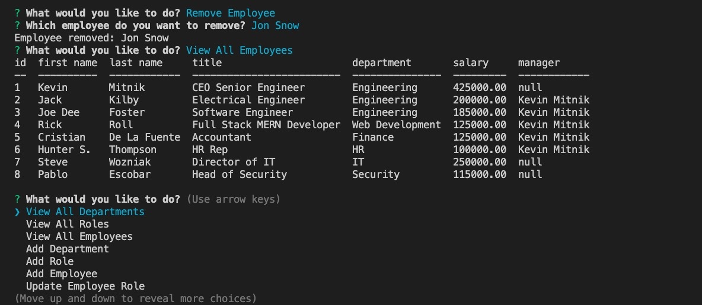
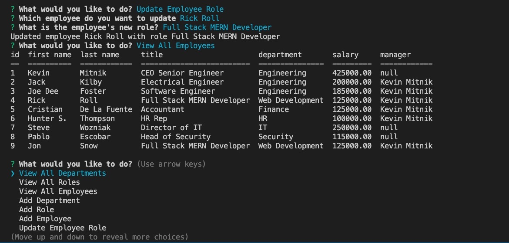
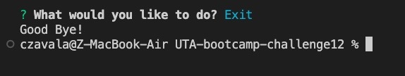
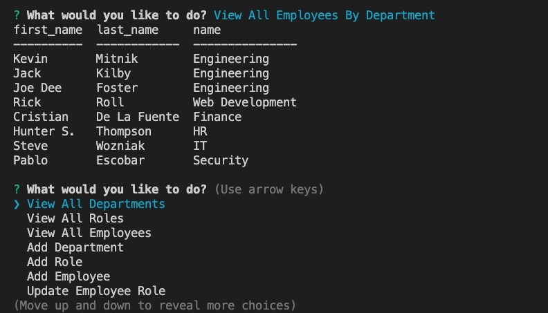


